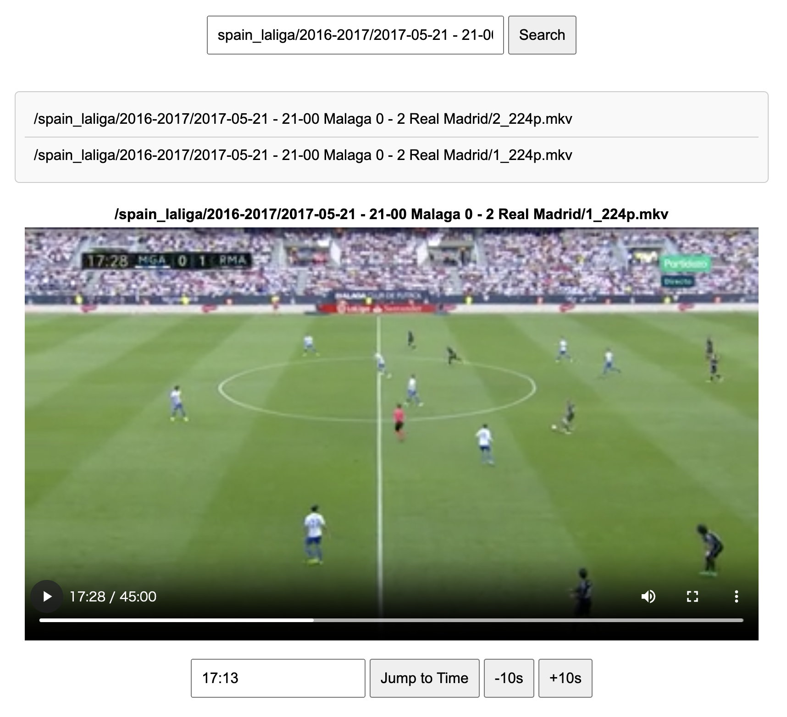

# Simple Video Viewer

a single html page for viewing local videos



## install

1. install dependencies

    ```shell
    npm install
    ```

2. prepare videos

3. list path of videos in local_video_paths.txt

4. run `make build`

## run

1. simply access `index.html` in browser
